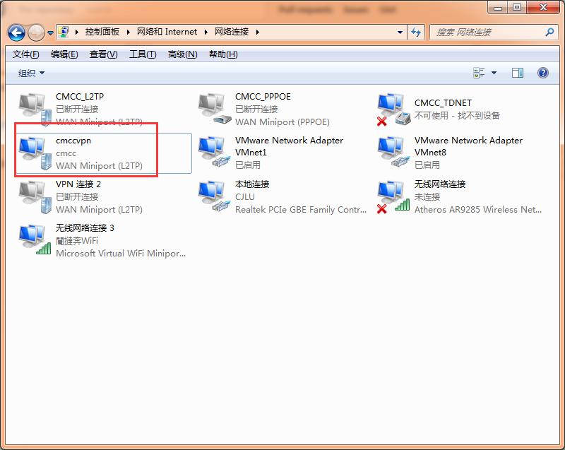

# 自动登录校园网
 [中国计量大学](http://www.cjlu.edu.cn)
#### @date:20161019
#### @author:arckalsun@gmail.com
# 
### 命令行用法：
#### 第一种：
` python login.py username password vpnname vpnusername vpnpassword`
#### 第二种：
` python login.py username password vpnname vpnusername vpnpassword usevpn`
#### 参数解释：
* username 内网账号
* password 内网密码
* vpnname VPN名字
* vpnusername VPN 账号，即外网账号
* vpnpassword VPN 密码，即外网密码
* usevpn 使用vpn，可以是任意非空字符串

### 设置为开机启动

* 1 先配置好VPN，这样可以不用随e行 或 闪讯来联网了。
* 2  新建一个文件，后缀名为bat,在里面写入一行：
``` 
python [F:\github\AutoLoginCJLU\AutoLoginCJLU\CJLULogin.py] username password vpnname vpnusername vpnpassword
```  
     把[ ]内容换为你自己电脑上CJLULogin.py的绝对路径

* 3  将此bat文件保存到[启动]文件夹，打开方式为【开始】--【所有程序】--【启动】

##Windows系统

### 请先在本机配置好VPN,具体方法参见http://blog.csdn.net/u014108439/article/details/51591126
## Unix系统
### 请自行Google相关命令
### 本程序在Windows系统下可以运行，Linux系统请自行测试
### 可以写个批处理文件，写入命令，存为开机自启动脚本
### 
## 其实这个程序有很多提高的地方，可以设计的更精巧，更智能和人性化。唉，我也是太懒了，就图个能用就行了。抛砖引玉，希望大家写出更好的程序。
#
#
